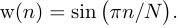

# Оконные функции

## Типовые оконные функции

### Прямоугольное окно

- Тревиальное окно. Даёт 
- УБЛ ~ -13дБ
- Наилучшее разрешение по частоте за счёт самой минимальной ширины главного лепестка

### Треугольное окно

 [[1][dsplib]]

[dsplib]: https://ru.dsplib.org/content/windows/windows.html

### Синусоидальное окно

### Окно Ханна

### Окно Бартлетта-Ханна

### Окно Ланцоша

### Окно Хемминга

Оптимальное значение параметра a0 = 25/46 ≈ 0.54 [[2][hamming-mit]][[3][hamming-stanford]]

[hamming-mit]: https://web.mit.edu/xiphmont/Public/windows.pdf
[hamming-stanford]: https://ccrma.stanford.edu/~jos/sasp/Hamming_Window.html

### Окно Блэкмана

Оптимальное значение a = 0.16

- Окно содержащее три слагаемых обладает более низким уровнем боковых лепестков спектральной плотности энергии.

### Окно Блэкмана-Харриса

Оптимальные значения a0 = 0.35875, a1 = 0.48829, a2 = 0.14128, a3 = 0.01168

### Окно Натталла

Оптимальные значения a0 = 0.355768, a1 = 0.487396, a2 = 0.144232, a3 = 0.012604

### Окно Блэкмана-Натталла

Оптимальные значения a0 = 0.3635819, a1 = 0.4891775, a2 = 0.1365995, a3 = 0.0106411

### Окно с плоской вершиной

Оптимальные значения a1 = 1.93, a2 = 1.29, a3 = 0.388, a4 = 0.032

### Параметрическое окно Дольф–Чебышева

Полином Чебышева

Условие симметрии окна

Частотная характеристика окна

### Окно Гаусса

### Окно Кайзера

I0(x) - модифицированная функция Бесселя первого рода нулевого порядка

2 < alpha < 16

## Характеристики оконных функций

ДПФ может быть представлено в виде гребенчатого фильтра, составленного из набора однотипных, здвинутых по частоте полосовых фильтров. 
Либо в виде набора согласованных фильтров для гармонических сигналов, каждый для своей частоты.
Центральная частота каждого фильтра настраивается на частоту извлекаемой ДПФ гармоники, а полоса фильтра определяется частотным расстоянием между гармониками.

### Когерентное усиление

**Gc**

Соответствует значению квадрата модуля спектра сигнала на нулевой частоте, либо квадрату суммы отсчётов оконной функции.

Измеряется в дБ по мощности.

Максимальное усиление может быть обеспечено только прямоугольным окном. Все остальные окна, имеющие спадающую к краям оконную функцию, будут обладать меньшим значением усиления.

### УБЛ

Уровень боковых лепестков

### Ширина главного лепестка

Определяется по уровням

Уровень|Обозначение
------:|:----------
  -3дБ | BW3
  -6дБ | BW6
     0 | BW0

### Уровень гребешковых искажений

**Ls**

Наблюдается при неточном совпадении частоты гармонического сигнала с частотой какого-либо из полосовых фильтров ДПФ. 

В этом случае мощность сигнала захватывается не только основным фильтром, но и частично соседними (как по боковой части главного лепестка фильтра, так и по боковым лепесткам), что приводит к эффекту растекания спектра.

Идеально спроектированный гребенчатый фильтр ДПФ должен быть составлен из таких полосовых фильтров, что каждый фильтр 

- должен быть точно настроен на частоту своей гармонической составляющей, 
- обладать полосой пропускания, не захватывающей соседние гармоники,
- нули боковых лепестков должны точно попадать на частоты соседних гармонических составляющих.

В тревиальном виде такой фильтр может быть построен для периодического спектра сигнала.

Определяется наложением полос пропускания полосовых фильтров ДПФ, что риводит к захвату фильтром соседних гармоник.

Определяется уровнем пересеычения АЧХ полосовых фильтров.

### Оконное сглаживание

Уменьшает степень растекания спектра за счёт снижения УБЛ полосовых фильтров ДПФ.

Позволяет увеличить динамический диапазон спектрального анализа и уменьшить уровень гребешковых искажений.

### Эквивалентная шумовая полоса

Ширина полосы захвата эквивалентного полосового фильтра с идеальной прямоугольной формой частоотной характеристики, обеспечивающей такое же значение мощности на выходе, что и полосовой фильтр ДПФ с исследуемой оконной функцией. При наличии Белого шума на входе.

Другими словами: если для Белого шума использовать эквивалентную функцию с идеальной прямоугольной частотной характеристикой, то какая ширина полосы понадобится, что бы обеспечить такой же уровень мощности в результате преобразования?

Для прямоугольного окна значение = 1. Для спадающих ук краям значение всегда большеединицы. 

## Источник информации

1. [Оконные функции на сайте dsplib.org][dsplib]
2. [On the Use of Windows for Harmonic Analysis
with the Discrete Fourier Transform / FREDRIC J. HARRIS, MEMBER, IEEE // PROCEEDINGS OF THE IEEE, VOL. 66, NO. 1, JANUARY 1978][hamming-mit]
3. [Hamming Window на сайте института Стенфорда][hamming-stanford]