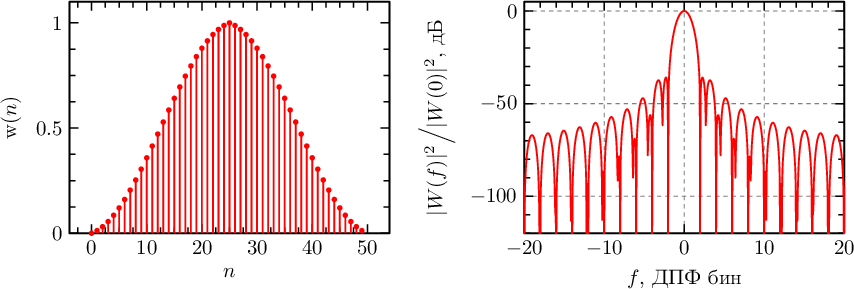
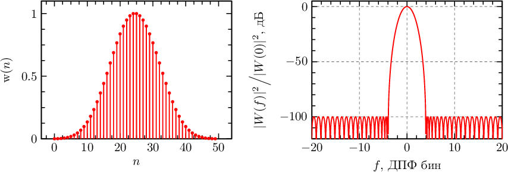
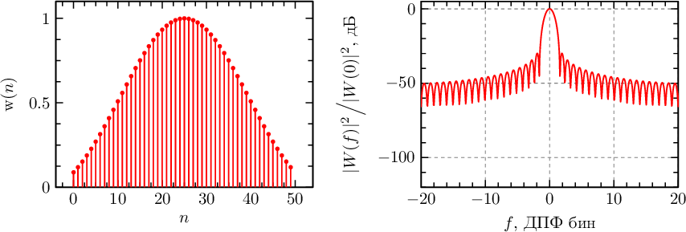

# Оконные функции

Сводка по реализованным оконным функциям пакета. Для каждой функции приведены:
- Название
- Формула в LaTeX
- Ключевые преимущества / особенности
- Типичные области применения
- Источники (основные научные публикации)

Используем обозначения:
- `N` – длина окна
- `0 \le n < N` – индекс отсчёта
- `x = n / N` – нормированная позиция
- `\operatorname{sinc}(z) = \dfrac{\sin z}{z}`
- `I_0` – модифицированная функция Бесселя нулевого порядка

## Типовые оконные функции

### Прямоугольное окно (Rectangle / Boxcar)

$$
 w[n] = 1, \qquad 0 \le n < N
$$

**Преимущества:** максимальное когерентное усиление, минимальная ширина главного лепестка (наилучшее частотное разрешение)

**Недостатки:** высокий уровень боковых лепестков (УБЛ ≈ −13 dB), сильная утечка спектра

**Когда применять:** анализ узкополосных сигналов с точно кратными частотами, когда утечка некритична; для измерения максимальной амплитуды без оконного ослабления

**Источники:** [Harris1978]

---
### Треугольное окно (Triangular / Bartlett)

$$
 w[n] = 1 - 2\left|\frac{n}{N} - \frac{1}{2}\right| = \frac{N - 2\left|n - \tfrac{N}{2}\right|}{N}
$$

**Преимущества:** ниже боковые лепестки по сравнению с прямоугольным; простота

**Недостатки:** шире главный лепесток → хуже разрешение

**Когда применять:** базовое сглаживание, простая аподизация при умеренных требованиях к подавлению УБЛ

**Источники:** [Harris1978]

---
### Синусоидальное окно (Sine)

$$
 w[n] = \sin\left(\pi \frac{n}{N}\right)
$$

**Преимущества:** узкий главный лепесток, гладкие края

**Недостатки:** сравнительно высокие боковые лепестки

**Когда применять:** простые задачи интерполяции/FFT, составление комбинированных окон

**Источники:** [Harris1978]

---
### Окно Ханна (Hann)

$$
 w[n] = \sin^2\left(\pi \frac{n}{N}\right) = \tfrac{1}{2} - \tfrac{1}{2}\cos\left(\frac{2\pi n}{N}\right)
$$

**Преимущества:** хороший компромисс между разрешением и снижением утечки

**Недостатки:** не самое низкое подавление боковых лепестков

**Когда применять:** универсальное окно по умолчанию для спектрального анализа

**Источники:** [Harris1978]

---
### Окно Бартлетта–Ханна (Bartlett–Hann)

$$
 w[n] = 0.62 - 0.48\left|\frac{n}{N} - \frac{1}{2}\right| - 0.38\cos\left(\frac{2\pi n}{N}\right)
$$

**Преимущества:** компромисс между треугольным и косинусным окнами, сниженная утечка

**Недостатки:** шире главный лепесток, чем у прямоугольного/синусного

**Когда применять:** умеренное подавление утечки при приемлемом разрешении

**Источники:** [Harris1978]

---
### Окно Ланцоша (Lanczos)

$$
 w[n] = \operatorname{sinc}\left(2\pi \frac{n}{N} - \pi\right) = \operatorname{sinc}\left(\pi\left(\frac{2n}{N} - 1\right)\right)
$$

**Преимущества:** хорошее подавление боковых лепестков, подходит для интерполяции

**Недостатки:** не столь низкие дальние лепестки как у специализированных многочленных окон

**Когда применять:** ресэмплинг, интерполяция изображений/сигналов, улучшение разрешения

**Источники:** [Lanczos1964], [Harris1978]

---
### Окно Хэмминга (Hamming)

$$
 w[n] = a_0 - (1 - a_0) \cos\left(\frac{2\pi n}{N}\right),\quad a_0 = \frac{25}{46} \approx 0.543478
$$

**Преимущества:** ниже утечка по сравнению с Ханной, сохраняет разумное разрешение

**Недостатки:** шире главный лепесток чем у прямоугольного, не минимальный УБЛ

**Когда применять:** анализ сигналов с умеренными требованиями к подавлению боковых лепестков

**Источники:** [Hamming1950], [Harris1978], [MITWindows], [StanfordHamming]

---
### Окно Блэкмана (Blackman)

Параметрическая форма:
$$
 w[n] = (1 - \alpha) - \cos\left(\frac{2\pi n}{N}\right) + \alpha \cos\left(\frac{4\pi n}{N}\right),\quad \alpha = 0.16
$$
Стандартная запись через коэффициенты:
$$
 w[n] = a_0 - 0.5\cos\left(\frac{2\pi n}{N}\right) + a_1\cos\left(\frac{4\pi n}{N}\right),\; a_0=\frac{1-\alpha}{2},\; a_1=\frac{\alpha}{2}
$$

**Преимущества:** более сильное подавление боковых лепестков чем у Хэмминга/Ханна

**Недостатки:** шире главный лепесток → понижение разрешения

**Когда применять:** высокоточный спектральный анализ амплитуд при умеренной потере разрешения

**Источники:** [BlackmanTukey1958], [Harris1978]

---
### Окно Блэкмана–Харриса (Blackman–Harris)

$$
 w[n] = a_0 - a_1\cos\left(\frac{2\pi n}{N}\right) + a_2\cos\left(\frac{4\pi n}{N}\right) - a_3\cos\left(\frac{6\pi n}{N}\right)
$$
$$
 a_0 = 0.35875,\; a_1 = 0.48829,\; a_2 = 0.14128,\; a_3 = 0.01168
$$

**Преимущества:** очень низкие боковые лепестки, хорошая амплитудная точность

**Недостатки:** расширенный главный лепесток

**Когда применять:** точные измерения спектра приоритетно над разрешением

**Источники:** [BlackmanTukey1958], [Harris1978]

---
### Окно Наталла (Nuttall)

$$
 w[n] = a_0 - a_1\cos\left(\frac{2\pi n}{N}\right) + a_2\cos\left(\frac{4\pi n}{N}\right) - a_3\cos\left(\frac{6\pi n}{N}\right)
$$
$$
 a_0 = 0.355768,\; a_1 = 0.487396,\; a_2 = 0.144232,\; a_3 = 0.012604
$$

**Преимущества:** очень низкие боковые лепестки, гладкость

**Недостатки:** потеря разрешения из‑за ширины главного лепестка

**Когда применять:** измерительные задачи с широким динамическим диапазоном

**Источники:** [Nuttall1981]

---
### Окно Блэкмана–Наталла (Blackman–Nuttall)

$$
 w[n] = a_0 - a_1\cos\left(\frac{2\pi n}{N}\right) + a_2\cos\left(\frac{4\pi n}{N}\right) - a_3\cos\left(\frac{6\pi n}{N}\right)
$$
$$
 a_0 = 0.3635819,\; a_1 = 0.4891775,\; a_2 = 0.1365995,\; a_3 = 0.0106411
$$

**Преимущества:** низкие боковые лепестки, баланс между Nuttall и Blackman–Harris

**Недостатки:** уменьшенное разрешение

**Когда применять:** анализ слабых гармоник на фоне сильных компонентов

**Источники:** [Nuttall1981], [Harris1978]

---
### Окно с плоской вершиной (Flat Top)

$$
 w[n] = 1 - a_1\cos\left(\frac{2\pi n}{N}\right) + a_2\cos\left(\frac{4\pi n}{N}\right) - a_3\cos\left(\frac{6\pi n}{N}\right) + a_4\cos\left(\frac{8\pi n}{N}\right)
$$
$$
 a_1 = 1.93,\; a_2 = 1.29,\; a_3 = 0.388,\; a_4 = 0.032
$$

**Преимущества:** очень плоская вершина → минимальная ошибка измерения амплитуды

**Недостатки:** широкая главная полоса (снижение разрешения)

**Когда применять:** измерительные FFT‑приборы, калибровка уровня сигнала

**Источники:** [IEEE1057], [IEEE1241], [Harris1978]

---
### Параметрическое окно Дольфа–Чебышева (Dolph–Chebyshev)

Временная формула (реализация):
$$
\begin{aligned}
 q &= 10^{\gamma/20},\\
 b &= \cosh\left(\frac{\operatorname{arcosh}(q)}{N-1}\right),\\
 w[n] &= q + 2\sum_{i=1}^{m} \cos\Big((N-1)\arccos\big(b\cos(\tfrac{\pi i}{N}) \cdot \cos(\tfrac{2\pi (n-m-d) i}{N})\big)\Big)
\end{aligned}
$$
где
$$
 m = \begin{cases} \tfrac{N}{2}-1,& N\text{ чётное} \\ \tfrac{N-1}{2},& N\text{ нечётное} \end{cases},\quad d = \begin{cases} \tfrac{1}{2},& N\text{ чётное} \\ 0,& N\text{ нечётное}\end{cases}
$$

**Преимущества:** равноволновые боковые лепестки с настраиваемым уровнем, гибкая оптимизация компромисса

**Недостатки:** сложность вычисления, возможные численные проблемы при больших `N`/низких уровнях

**Когда применять:** строгий контроль УБЛ при проектировании фильтров и узкополосном анализе

**Источники:** [Dolph1946], [Harris1978]

---
### Окно Гаусса (Gaussian)

$$
 w[n] = \exp\left(-2\left(\frac{\frac{n}{N} - \frac{1}{2}}{\alpha}\right)^2\right)
$$

**Преимущества:** хорошая временно-частотная локализация, плавность, низкие дальние лепестки

**Недостатки:** параметрическая зависимость; не самый узкий главный лепесток

**Когда применять:** анализ аудио, временно-частотные преобразования, сглаживание

**Источники:** [Harris1978]

---
### Окно Кайзера (Kaiser)

$$
 w[n] = \frac{I_0\Big(\alpha\sqrt{1 - (2(\tfrac{n}{N}-\tfrac{1}{2}))^2}\Big)}{I_0(\alpha)}, \qquad 2 \lesssim \alpha \lesssim 16
$$

**Преимущества:** регулируемый компромисс ширина/УБЛ, удобство проектирования FIR (метод Кайзера)

**Недостатки:** не абсолютно минимальная ширина или минимум УБЛ, параметр требует подбора

**Когда применять:** автоматизированное проектирование фильтров, гибкая настройка характеристик

**Источники:** [Kaiser1966], [Harris1978]

---

## Характеристики оконных функций (кратко)

- Когерентное усиление: максимум у прямоугольного окна, снижается при аподизации
- Уровень боковых лепестков (УБЛ): минимизируется специализированными многочленными окнами (Blackman–Harris, Nuttall, Flat Top)
- Ширина главного лепестка: минимальна у прямоугольного, растёт при усложнении окна
- Эквивалентная шумовая полоса (ENBW): =1 для прямоугольного, >1 для остальных окон
- Выбор окна — баланс между разрешением (узкий главный лепесток) и подавлением утечки (низкие боковые лепестки)

## Литература и источники

[Harris1978]: F. J. Harris, On the Use of Windows for Harmonic Analysis with the Discrete Fourier Transform, Proc. IEEE, Vol.66, No.1, 1978, DOI:10.1109/PROC.1978.10837
[BlackmanTukey1958]: R. B. Blackman, J. W. Tukey, The Measurement of Power Spectra, 1958
[Dolph1946]: C. L. Dolph, A Current Distribution for Broadside Arrays Which Optimizes the Relationship Between Beam Width and Side-Lobe Level, Proc. IRE, 1946
[Kaiser1966]: J. F. Kaiser, Nonrecursive Digital Filter Design Using the I0-Sinh Window Function, 1966
[Nuttall1981]: A. H. Nuttall, Some Windows with Very Good Sidelobe Behavior, IEEE Trans. ASSP, 1981
[Hamming1950]: R. W. Hamming, Error Detecting and Error Correcting Codes, 1950
[Lanczos1964]: C. Lanczos, Evaluation of Noisy Data, JSIAM, 1964
[IEEE1057]: IEEE Std 1057, Standard for Digitizing Waveform Recorders
[IEEE1241]: IEEE Std 1241, Standard for Terminology and Test Methods for ADCs
[MITWindows]: https://web.mit.edu/xiphmont/Public/windows.pdf
[StanfordHamming]: https://ccrma.stanford.edu/~jos/sasp/Hamming_Window.html
[dsplib]: https://ru.dsplib.org/content/windows/windows.html